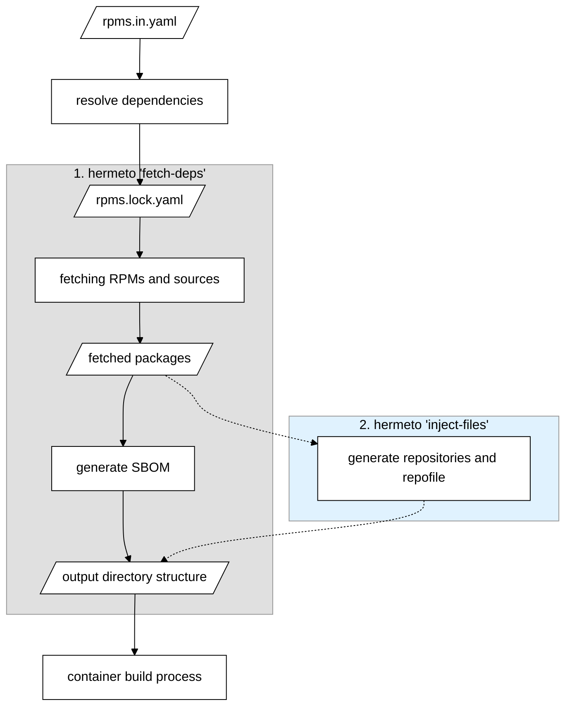

# Hermeto support for prefetching RPMs - design

## Introduction

Containers download RPMs at build time. With hermetic builds, this is not possible
because the build doesn't have access to the network. This feature solves this problem by pre-fetching
RPMs before the build process to allow for hermetic builds.

The general idea is that the developer specifies ahead of time what RPMs they want to have
available. In a step before the actual build, hermeto takes this information, downloads all of the
packages and prepares a repository that will be available during build.

## Requirements

1. The solution must work for processing all required architectures in one process.
2. The solution must work without changes to RPM or package management tooling.
3. The solution should work for all RPM based distributions.
4. The solution shouldn't require the maintainer to make significant changes to their Dockerfiles.
5. The solution should be able to propagate repoids for prefetched RPMs and modules to the container
   build.
    1. This will make sure the yum/dnf history command shows origin repositories correctly. This may
       be leveraged by user tools (e.g. Clair) to identify sources of the RPM content.
6. The solution must collect SRPMs for source container generation.
    1. Only applicable if the SRPMs were listed in the *rpms.lock.yaml* file.

## Block schema

The diagram shows the main function blocks, inputs and outputs. The fetch-deps command processes the
lock file and downloads all required items (RPMs, source RPMs, and module metadata) into a directory
structure that serves as input for the container build process. It also produces an SBOM with metadata
of the fetched RPMs.

As a next (optional) step, the other hermeto command (`inject-files`) will process the structure
created in the previous step and will generate repositories and .repo file.



## rpms.lock.yaml

Works as a configuration input file for prefetching. The format allows multiple architectures to be
listed.

```yaml
lockfileVersion: <version>
lockfileVendor: <vendor>
arches:
  - arch: <arch>
    packages:
      - repoid: <repoid>
        url: <url>
        checksum: <method>:<digest>
        size: <size>
    source:
      - repoid: <repoid-source>
        url: <url>
        checksum: <method>:<digest>
        size: <size>
    module_metadata:
      - repoid: <repoid>
        url: <url>
        checksum: <method>:<digest>
        size: <size>
```

`module_metadata` entries are needed when installing modular packages (e.g. from RHEL 8 module
streams). Unlike `packages` and `source`, the `repoid` field is **mandatory** for module metadata.

`<repoid>` or `<repoid-source>` values are not mandatory - when not specified, a random repoid name
is generated.
`checksum` key and `<size>` are not mandatory either - when not specified, (S)RPM file verification
won't be performed after download.

An example of the format follows.

```yaml
lockfileVersion: 1
lockfileVendor: redhat
arches:
  - arch: x86_64
    packages:
      - repoid: fedora
        url: https://kojipkgs.fedoraproject.org/compose/rawhide/latest-Fedora-Rawhide/compose/Everything/x86_64/os/Packages/l/libsodium-1.0.19-4.fc40.x86_64.rpm
        checksum: sha256:e8ec4a0e9b5e9246c661d5562fc692c697f6769846de718d3c8e0929dd5ae9de
        size: 178718
      - repoid: fedora
        url: https://kojipkgs.fedoraproject.org/compose/rawhide/latest-Fedora-Rawhide/compose/Everything/x86_64/os/Packages/v/vim-enhanced-9.1.113-1.fc41.x86_64.rpm
        checksum: sha256:dca5053a4ce789b8f70e063a45e9a7b512d8d8bf5baa8e265a7f5b9ce0c90412
        size: 1954810
      - repoid: fedora
        url: https://kojipkgs.fedoraproject.org/compose/rawhide/latest-Fedora-Rawhide/compose/Everything/x86_64/os/Packages/v/vim-data-9.1.113-1.fc41.noarch.rpm
        checksum: sha256:4d3169872508b93e8ce4d6d9b7fa5ab4177cd571258248138dc1b3c8477d5c36
        size: 23475
      - repoid: fedora
        url: https://kojipkgs.fedoraproject.org/compose/rawhide/latest-Fedora-Rawhide/compose/Everything/x86_64/os/Packages/x/xxd-9.1.113-1.fc41.x86_64.rpm
        checksum: sha256:81fa409c8be8c125964787f93f13a4dc9d8f1667d8630cf8ba425ec1a266beca
        size: 37701
      - repoid: fedora
        url: https://kojipkgs.fedoraproject.org/compose/rawhide/latest-Fedora-Rawhide/compose/Everything/x86_64/os/Packages/v/vim-minimal-9.1.113-1.fc41.x86_64.rpm
        checksum: sha256:b31875f92a00b53432d3e46261d371e421814ff0ba62932e56490771d64787d7
        size: 823891
      - repoid: fedora
        url: https://kojipkgs.fedoraproject.org/compose/rawhide/latest-Fedora-Rawhide/compose/Everything/x86_64/os/Packages/v/vim-filesystem-9.1.113-1.fc41.noarch.rpm
        checksum: sha256:eaeaf2fefd929916e70e75cd2400a32e175d9f7025bcec208a70ab5055259914
        size: 18018
      - repoid: fedora
        url: https://kojipkgs.fedoraproject.org/compose/rawhide/latest-Fedora-Rawhide/compose/Everything/x86_64/os/Packages/w/which-2.21-41.fc40.x86_64.rpm
        checksum: sha256:bd005b31a2d65a9f1e7ab9298eecab63a5536d67d714d29faa2a5bcddf44cd27
        size: 42442
      - repoid: fedora
        url: https://kojipkgs.fedoraproject.org/compose/rawhide/latest-Fedora-Rawhide/compose/Everything/x86_64/os/Packages/v/vim-common-9.1.113-1.fc41.x86_64.rpm
        checksum: sha256:ee5e2da2fb37d9fd10e4b529b8e17ae105ea885d955e227e20b61b8be3f30f82
        size: 7942116
      - repoid: fedora
        url: https://kojipkgs.fedoraproject.org/compose/rawhide/latest-Fedora-Rawhide/compose/Everything/x86_64/os/Packages/g/gpm-libs-1.20.7-46.fc40.x86_64.rpm
        checksum: sha256:39558e6ac8a5686df32a166428cbd754059a31b3c824c8e34a6a72297075df10
        size: 20509
    source:
      - repoid: fedora-sources
        url: https://kojipkgs.fedoraproject.org/compose/rawhide/latest-Fedora-Rawhide/compose/Everything/source/tree/Packages/v/vim-9.1.113-1.fc41.src.rpm
        checksum: sha256:64938dc971a5aba5e5f94f431b4e17d8f0e10b0fbb19dec1ef7fdcef78dffea2
        size: 14674115
      - repoid: fedora-sources
        url: https://kojipkgs.fedoraproject.org/compose/rawhide/latest-Fedora-Rawhide/compose/Everything/source/tree/Packages/g/gpm-1.20.7-46.fc40.src.rpm
        checksum: sha256:0261bc3f223efbf6c374f7126161ffe5e6cb653393e72ec84b026c0ca82d046c
        size: 251673
      - repoid: fedora-sources
        url: https://kojipkgs.fedoraproject.org/compose/rawhide/latest-Fedora-Rawhide/compose/Everything/source/tree/Packages/w/which-2.21-41.fc40.src.rpm
        checksum: sha256:c4b994bfcd17e299dc5e21db8c5d6a1692a96728e745d8fd55d36f2f473c23bf
        size: 182501
      - repoid: fedora-sources
        url: https://kojipkgs.fedoraproject.org/compose/rawhide/latest-Fedora-Rawhide/compose/Everything/source/tree/Packages/l/libsodium-1.0.19-4.fc40.src.rpm
        checksum: sha256:31bb7b9ea83a26f0ff7333ac1016d73677ca5f93ba44016614dad477443d5985
        size: 1979932
```

## Input

* The rpms lockfile
* Path for storing the output

## Output

The given *output* path is populated with the following structure.

```
<output>/deps/rpm/<arch>/<repoid>/*.rpm
<output>/deps/rpm/<arch>/<repoid-source>/*.src.rpm
<output>/deps/rpm/<arch>/<repoid>/<module-metadata-file>
<output>/bom.json
```

Module metadata files are stored alongside RPMs in the same repoid directory. They are not included
in the SBOM, they exist solely so that `createrepo_c` can discover and include them when generating
repodata during the `inject-files` step.

`deps/rpm` part - this part of the path is for compatibility with other package manager modules
hermeto works with (for example `deps/npm`).

The SBOM file format is CycloneDX and PURLs are generated as per
[specification](https://redhatproductsecurity.github.io/security-data-guidelines/purl/).

Example:

```json
{
  "annotations": [
    {
      "subjects": [
        "pkg:rpm/centos/alternatives@1.24-2.el9?arch=x86_64&checksum=sha256:1e9effe6...&repository_id=baseos",
        "pkg:rpm/centos/centos-stream-repos@9.0-36.el9?arch=noarch&repository_id=baseos"
      ],
      "annotator": {
        "organization": {
          "name": "red hat"
        }
      },
      "text": "hermeto:backend:rpm",
      "timestamp": "2025-01-01T00:00:00Z"
    }
  ],
  "bomFormat": "CycloneDX",
  "specVersion": "1.6",
  "version": 1,
  "metadata": {
    "tools": [
      {
        "name": "hermeto",
        "vendor": "red hat"
      }
    ]
  },
  "components": [
    {
      "bom-ref": "pkg:rpm/centos/alternatives@1.24-2.el9?arch=x86_64&checksum=sha256:1e9effe6...&repository_id=baseos",
      "name": "alternatives",
      "purl": "pkg:rpm/centos/alternatives@1.24-2.el9?arch=x86_64&checksum=sha256:1e9effe6...&repository_id=baseos",
      "version": "1.24",
      "properties": [{"name": "hermeto:found_by", "value": "hermeto"}],
      "type": "library"
    },
    {
      "bom-ref": "pkg:rpm/centos/centos-stream-repos@9.0-36.el9?arch=noarch&repository_id=baseos",
      "name": "centos-stream-repos",
      "purl": "pkg:rpm/centos/centos-stream-repos@9.0-36.el9?arch=noarch&repository_id=baseos",
      "version": "9.0",
      "properties": [
        {"name": "hermeto:found_by", "value": "hermeto"},
        {"name": "hermeto:missing_hash:in_file", "value": "rpms.lock.yaml"}
      ],
      "type": "library"
    }
  ]
}
```

The optional 2nd step will add metadata:

```
<output>/deps/rpm/<arch>/repos.d/hermeto.repo
<output>/deps/rpm/<arch>/<repoid>/repodata/
```

Content of hermeto.repo file (with as many repositories included as used in the lockfile):

```ini
[<repoid>]
baseurl = file://<for-output-dir>/deps/rpm/<arch>/<repoid>
```

Note that the repo identifiers in the filesystem structure match the identifiers in the repo file,
and come from the lockfile. The `<for-output-dir>` is the path where the output will be mounted
in the build container, provided via the `--for-output-dir` CLI argument.
If `<repoid>` wasn't specified, a random value is generated. And the section will additionally
contain the key `name` describing the repository.

The `repos.d/` subdirectory for the corresponding architecture can be mounted into the build
container to */etc/yum.repos.d/*.

## Benefits

* No modification of the Dockerfile is needed. When built without the pre-fetching, repositories
  which are configured in the base image would be used.
* No repodata is needed for the RPM packages on the input side, the user only needs to provide a
  list of URLs where packages are located and repoids under which the packages should appear in the
  container. This means that RPMs can be taken directly from artifact storage solutions without the
  need to create a repodata for them first. Hermeto will take care of creating repodata for the
  build process.

## Important things to keep in mind

* Hermeto does not fetch or parse repodata. It only downloads files from URLs listed in
  *rpms.lock.yaml*, RPM packages, source RPMs, and module metadata. Because of that, hermeto
  cannot validate repodata signatures.
* During the `inject-files` step, hermeto generates repodata for the output repositories by running
  `createrepo_c` on each repoid directory. For modular content, module metadata files must be
  downloaded into the repoid directory first so that `createrepo_c` can discover and include them.
* For module metadata entries, the `repoid` field is mandatory so that hermeto can place them in the
  correct repository.

## What about …

### … handling dependencies

It doesn't. Users are required to include all transitive dependencies in the *rpms.lock.yaml* file.
Ideally, a tool would do this for them.

The prefetching step doesn't really care about dependencies. It just downloads and prepares what
it's told to.

If there is a missing dependency, there will be a failure at build time.

If the lockfile lists additional packages, the build will not use them, so it's just wasting time
and bandwidth at the prefetching step (and possibly including irrelevant sources in source
containers).